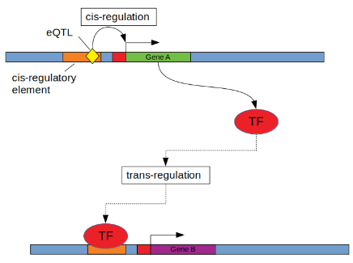


Schadt, E., Lamb, J., Yang, X. et al. [*An integrative genomics approach to infer causal associations between gene expression and disease*](https://doi.org/10.1038/ng1589). Nat Genet 37, 710–717 (2005).


## Mediation analysis



Figure by Sean Bankier from [this review](https://doi.org/10.3389/fendo.2022.949061).


## Instrumental variable analysis

## Assignment


We will analyze data from the Human Liver Cohort:

Schadt EE, Molony C, Chudin E, Hao K, Yang X, Lum PY, et al. (2008) [*Mapping the Genetic Architecture of Gene Expression in Human Liver*](https://doi.org/10.1371/journal.pbio.0060107). PLoS Biol 6(5): e107. 

Sign up for a [Synapse account](https://www.synapse.org/). Find the [Human Liver cohort data](https://www.synapse.org/#!Synapse:syn4499)

