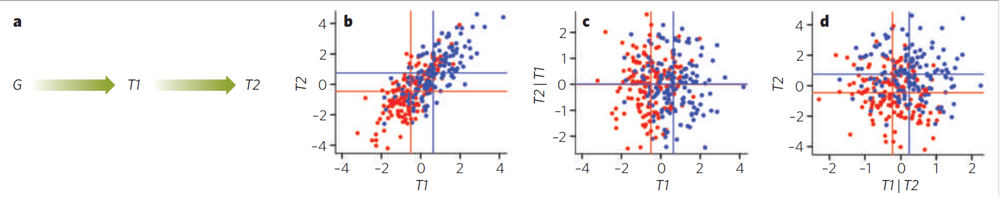
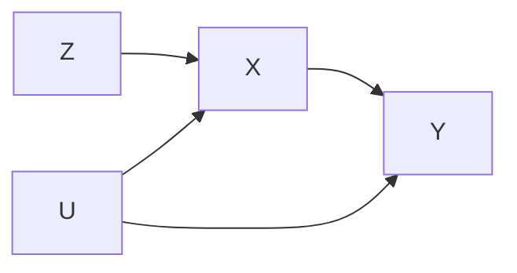


Schadt, E., Lamb, J., Yang, X. et al. [*An integrative genomics approach to infer causal associations between gene expression and disease*](https://doi.org/10.1038/ng1589). Nat Genet 37, 710–717 (2005).


## Mediation analysis



Figure by Sean Bankier from [this review](https://doi.org/10.3389/fendo.2022.949061).


The [GTEx study](../genetics-gene-expression/) identified trans-eQTLs that are also cis-eQTLs and asked if the cis-eGene could be the *cause* of the trans-eQTL association (see fig above), that is, if the following model is supported by the data:

where $Z$ is a SNP that is a cis-eQTL for gene $X$ and trans-eQTL for gene $Y$. This model implies that $X$ blocks the path between $Z$ and $Y$, and hence that $Z$ and $Y$ are independent conditional on $X$, in mathematical notation

$$
Z \perp Y \mid X
$$

The principle for testing whether the model $Z\to X \to Y$ is true using the conditional independence criterion is illustrated in the figure below. Assuming linear relations between all variables, three conditions must be met:

1. The expression levels of $X$ differ significantly between the genotype groups of $Z$ (to confirm the $Z\to X$ association).
2. The expression levels of $Y$ differ significantly between the genotype groups of $Z$ (to confirm the $Z\to Y$ association).
3. The residuals of $Y$ after regression on $X$ do *not* differ differ significantly between the genotype groups of $Z$ (to confirm that the $Z\to Y$ association is mediated by $X$, and hence that $Z\to X \to Y$ is true).



Causal ordering yields conditional independence

Figure from: Rockman. [*Reverse engineering the genotype–phenotype map with natural genetic variation*](https://doi.org/10.1038/nature07633), Nature 456:738–744 (2008).


## Instrumental variable analysis / Mendelian randomization

The mediation method fails if $X$ and $Y$ are affected by common cause $U$ (which may be an unknown or hidden variable):

In this case, conditioning on $X$ opens the [collider](https://en.wikipedia.org/wiki/Collider_(statistics)) $Z \to X \leftarrow U$, creating a path $Z\\; --- \\; U \to Y$, such that the residuals of $Y$ will still show a difference between the genotype groups of $Z$, and the mediation method concludes (wrongly!) that the $Z\to Y$ association must be due to another factor than $X$ (no causal $X\to Y$  relation).

Instrumental variable, known as [Mendelian randomization (MR)](https://en.wikipedia.org/wiki/Mendelian_randomization), is an alternative causal inference approach that is not affected by hidden confounders $U$, but with subtly different underlying assumptions.

Specifically, in MR we assume that the $Z\to Y$ association **must** be due to $X$ (for instance because $X$ is the only cis-eGene of $Z$, and trans-eQTL associations must be mediated by some initial cis effects), and we seek to estimate the magnitude of the causal effect of $X$ on $Y$.

The diagram above can be written as a [structural equation model](https://en.wikipedia.org/wiki/Structural_equation_modeling)

$$
\begin{aligned}
  X &= a Z + c_X U + E_X\\
  Y &= b X + c_Y U + E_Y
\end{aligned}
$$

where $E_X$ and $E_Y$ are error terms, mutually independent and independent of $Z$ and $U$. Since $Z$ and $U$ are assumed to be independent (no arrows in the diagram), it follows that

$$
\begin{aligned}
  \mathrm{cov}(Y,Z) &= b\\; \mathrm{cov}(X,Z)
\end{aligned}
$$

and hence the causal effect of $X$ on $Y$ is estimated by the ratio of covariances:

$$
b = \frac{\mathrm{cov}(Y,Z)}{\mathrm{cov}(X,Z)}
$$

## Assignment


We will analyze data from the Human Liver Cohort:

Schadt EE, Molony C, Chudin E, Hao K, Yang X, Lum PY, et al. (2008) [*Mapping the Genetic Architecture of Gene Expression in Human Liver*](https://doi.org/10.1371/journal.pbio.0060107). PLoS Biol 6(5): e107. 

Sign up for a [Synapse account](https://www.synapse.org/). Find the [Human Liver cohort data](https://www.synapse.org/#!Synapse:syn4499)

