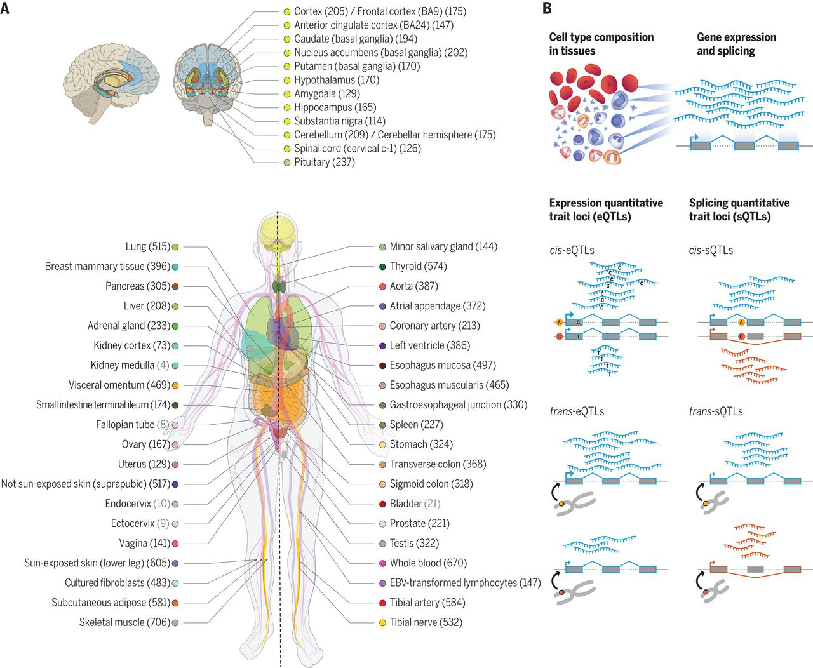
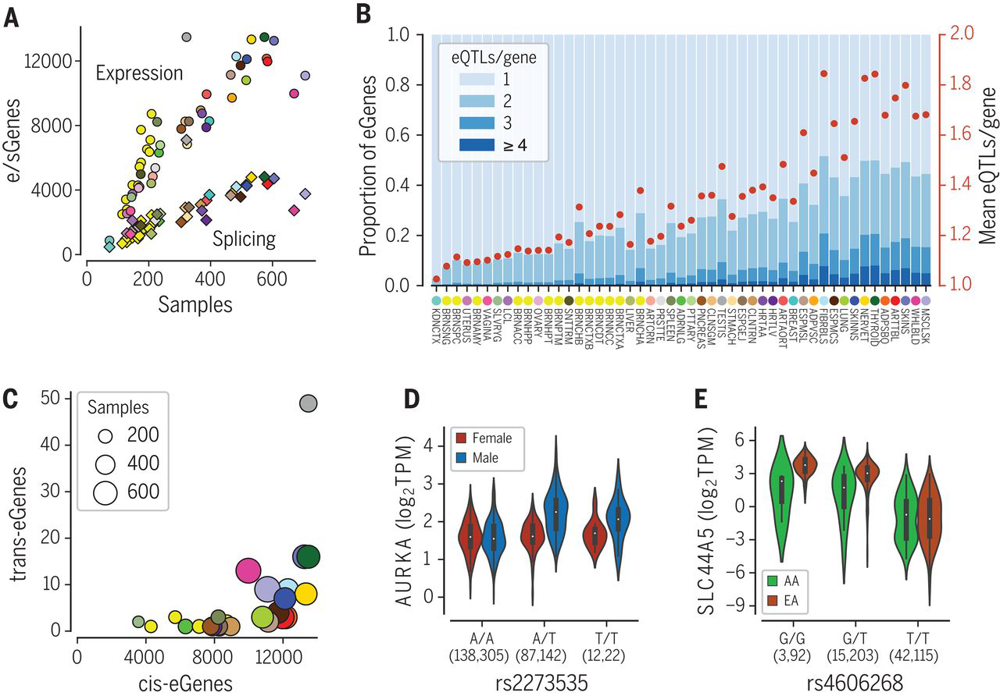
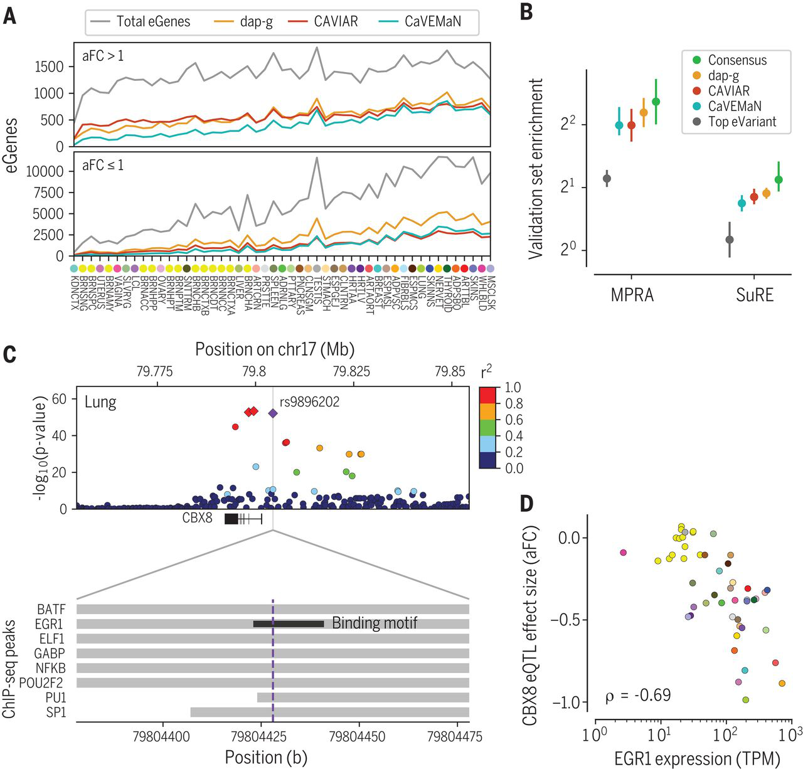
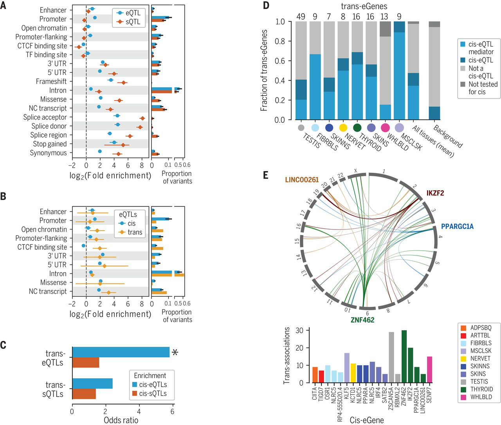
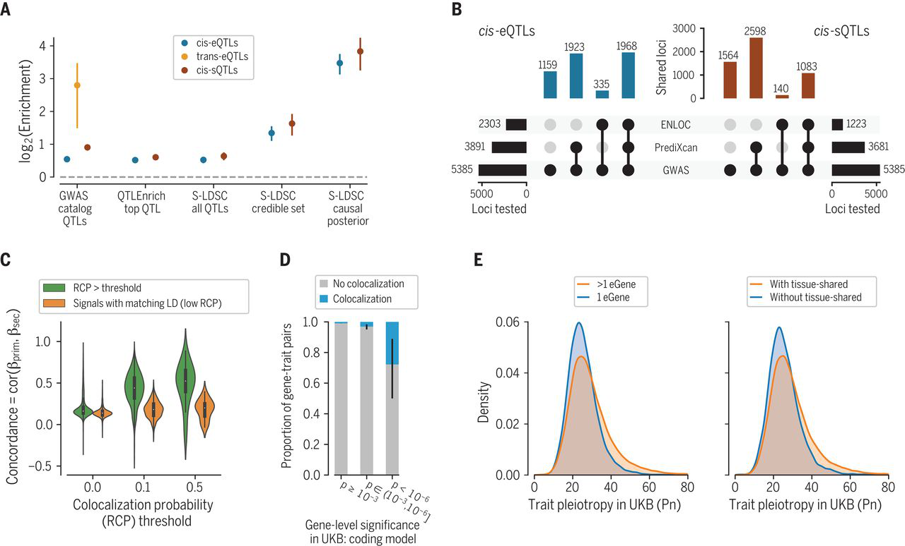
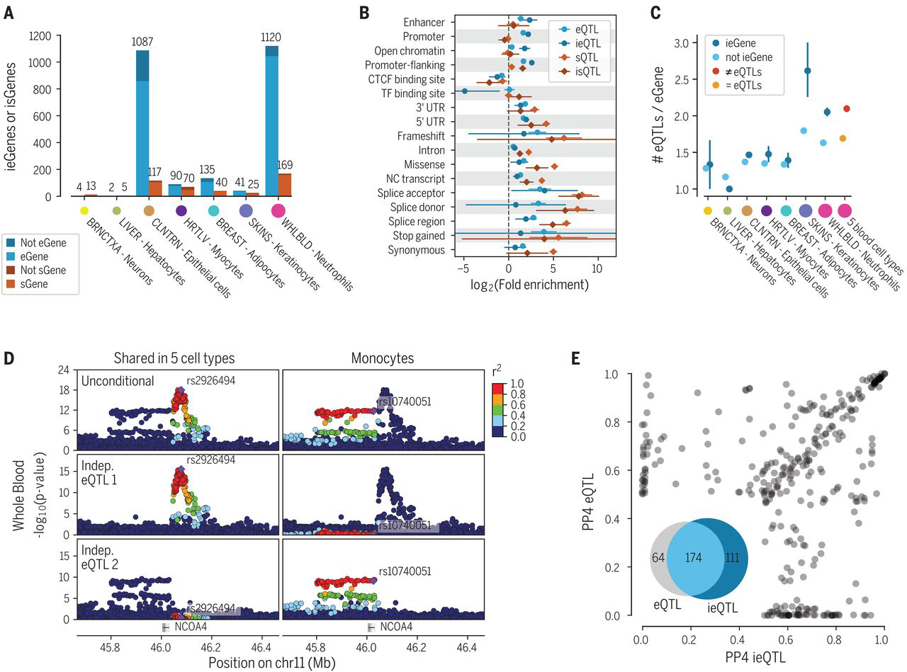


Schadt EE, Molony C, Chudin E, Hao K, Yang X, Lum PY, et al. (2008) [*Mapping the Genetic Architecture of Gene Expression in Human Liver*](https://doi.org/10.1371/journal.pbio.0060107). PLoS Biol 6(5): e107. 


 

## Assignment


The GTEx Consortium. *The GTEx Consortium atlas of genetic regulatory effects across human tissues*. Science **369**, 1318--1330 (2020).

<https://doi.org/10.1126/science.aaz1776>

<https://www.gtexportal.org/>



## The GTEx Consortium atlas of genetic regulatory effects across human tissues

### Figure 1 - Concepts

- Genome-wide association studies (GWAS)
- Expression quantitative trait locus (eQTL)
- *cis* vs *trans* eQTLs

### Figure 2 - Concepts

- Linkage disequilibrium (LD)
- Stepwise regression

### Figure 3 - Concepts

- Statistical finemapping
- ENCODE in GWAS

### Figure 4 - Concepts

- Enrichment in functional annotations

### Figure 5 - Concepts

- Mediation
- Mendelian randomization (MR)

### Figure 6 - Concepts

- Logistic regression

