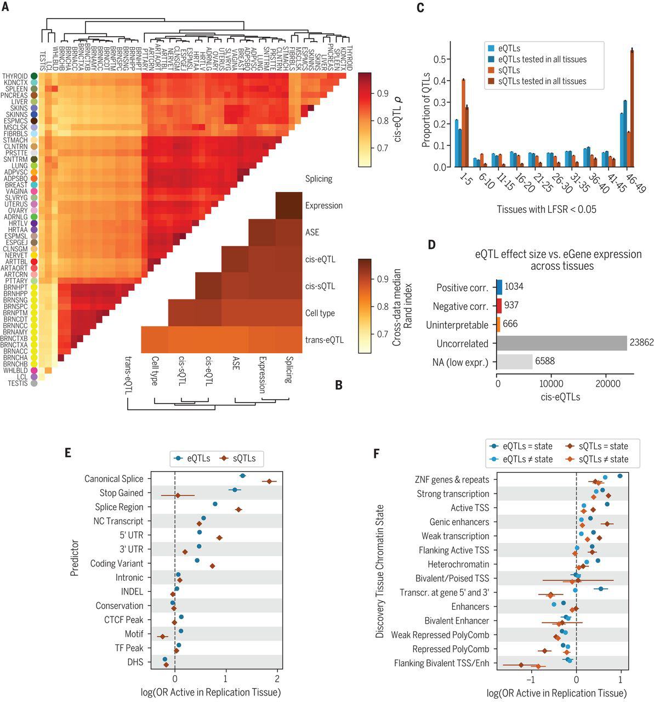


The GTEx Consortium. [*The GTEx Consortium atlas of genetic regulatory effects across human tissues*](https://doi.org/10.1126/science.aaz1776). Science **369**, 1318--1330 (2020).

See also the [GTEx portal](https://www.gtexportal.org/)


 

## The GTEx Consortium atlas of genetic regulatory effects across human tissues

### Figure 1



Figure obtained from [full text on EuropePMC](https://europepmc.org/article/med/32913098).


 Concepts

- Genome-wide association studies (GWAS)
- Expression quantitative trait locus (eQTL)
- *cis* vs *trans* eQTLs

### Figure 2 



Figure obtained from [full text on EuropePMC](https://europepmc.org/article/med/32913098).


Concepts

- Linkage disequilibrium (LD)
- Stepwise regression

### Figure 3 



Figure obtained from [full text on EuropePMC](https://europepmc.org/article/med/32913098).


Concepts

- Statistical finemapping
- ENCODE in GWAS

### Figure 4 



Figure obtained from [full text on EuropePMC](https://europepmc.org/article/med/32913098).


Concepts

- Enrichment in functional annotations
- Mediation analysis

### Figure 5



Figure obtained from [full text on EuropePMC](https://europepmc.org/article/med/32913098).


Concepts

- Mendelian randomization (MR)

### Figure 6 



Figure obtained from [full text on EuropePMC](https://europepmc.org/article/med/32913098).


Concepts

- Logistic regression

### Figure 7



Figure obtained from [full text on EuropePMC](https://europepmc.org/article/med/32913098).

