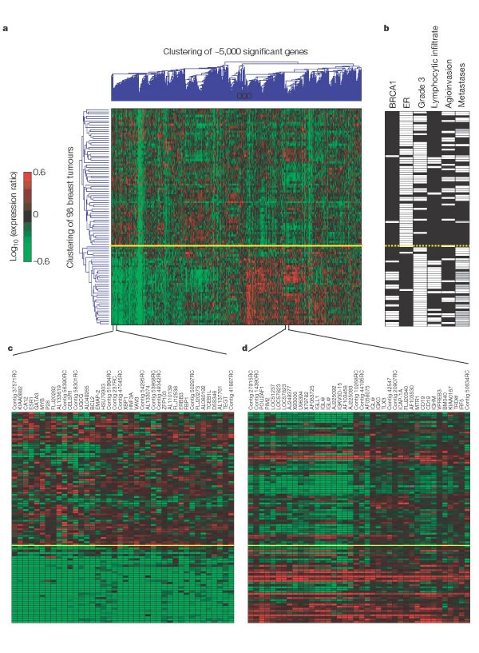
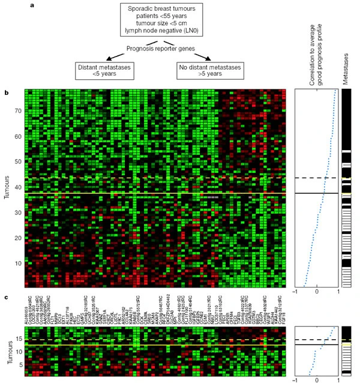

## Gene expression profiling predicts clinical outcome of breast cancer


  van 't Veer L et al. [*Gene expression profiling predicts clinical outcome of breast cancer*](https://doi.org/10.1038/415530a) . Nature 415:530 (2002).  
    
  See also the comment: [The molecular outlook](https://www.nature.com/articles/415484a)

  

The [study by van 't Veer et al](https://doi.org/10.1038/415530a) was one of the first to use to [microarrays](https://en.wikipedia.org/wiki/DNA_microarray), a brand-new technology at the time, to profile gene expression on a genome-wide scale from surgically removed tumour samples - breast tumours in this case. Another paper from around the same time is: Perou et al. [*Molecular portraits of human breast tumours*](https://www.nature.com/articles/35021093). The credit for being the first to using cluster analysis on gene expression data (from yeast) probably goes to Eisen et al. [Cluster analysis and display of genome-wide expression patterns](https://doi.org/10.1073/pnas.95.25.14863).

Van 't Veer et al clustered data from 98 tumours based on their similarities across approximately 5,000 differentially expressed genes - genes that showed more variation than expected by chance in the dataset. The most striking finding is in their Figure 1: the tumours segregated in two distinct groups that correlated strongly with clinical features, namely:

- [BRCA1 germline mutation](https://www.cancer.gov/about-cancer/causes-prevention/genetics/brca-fact-sheet): harmful variants in the *BRCA1* or *BRCA2* genes that markedly increase risk for developing breast cancer.
- [Estrogen receptor (ER) status](https://www.cancer.org/cancer/breast-cancer/understanding-a-breast-cancer-diagnosis/breast-cancer-hormone-receptor-status.html): breast tumour cells that express ER on their surface need [estrogen](https://en.wikipedia.org/wiki/Estrogen) to grow, and are therefore more susceptible to hormone therapy.
- [Tumour grade](https://www.cancer.gov/about-cancer/diagnosis-staging/diagnosis/tumor-grade): a measure of degree of abnormality of cancer cells.
- [Lymphocyte infiltration](https://www.cancer.gov/publications/dictionaries/cancer-terms/def/node-negative): an indication whether the cancer has spread to the lymph nodes.
- [Angionvasion](https://librepathology.org/wiki/Angioinvasion): an indication whether the cancer has spread to the blood vessels.
- [Metastatic status](https://www.cancer.gov/publications/dictionaries/cancer-terms/def/metastasis): an indication whether the cancer has spread to othre organs. 

Overall, tumours in the bottom group of the figure were clearly associated with measures that predict better patient outcome. 



**a**, Two-dimensional presentation of transcript ratios for 98 breast tumours across 4,968 significant genes. Each row represents a tumour and each column a single gene. As shown in the colour bar, red indicates upregulation, green downregulation, black no change, and grey no data available. The yellow line marks the subdivision into two dominant tumour clusters. **b**, Clinical data for the 98 patients. White indicates positive, black negative and grey denotes tumours derived from BRCA1 germline carriers who were excluded from the metastasis evaluation. **c**, Enlarged portion from a containing a group of genes that co-regulate with the ER-α gene (ESR1). Each gene is labelled by its gene name or accession number from GenBank. Contig ESTs ending with RC are reverse-complementary of the named contig EST. **d**, Enlarged portion from a containing a group of co-regulated genes that are the molecular reflection of extensive lymphocytic infiltrate, and comprise a set of genes expressed in T and B cells. (Gene annotation as in **c**.)

Figure obtained from [full text on EuropePMC](https://europepmc.org/article/med/11823860).


Following the discovery that unsupervised clustering of gene expression profiles identifies good and poor prognosis groups, the authors tried to identify a minimal prognostic signature from their data, which resulted in an optimal set of 70 marker genes, which they could validate in an independent set of tumour samples.



**a**, Use of prognostic reporter genes to identify optimally two types of disease outcome from 78 sporadic breast tumours into a poor prognosis and good prognosis group. **b**, Expression data matrix of 70 prognostic marker genes. Each row represents a tumour and each column a gene, whose name is labelled between **b** and **c**. Genes are ordered according to their correlation coefficient with the two prognostic groups. Tumours are ordered by the correlation to the average profile of the good prognosis group (middle panel). Solid line, prognostic classifier with optimal accuracy; dashed line, with optimized sensitivity. Above the dashed line patients have a good prognosis signature, below the dashed line the prognosis signature is poor. The metastasis status for each patient is shown in the right panel: white indicates patients who developed distant metastases within 5 years after the primary diagnosis; black indicates patients who continued to be disease-free for at least 5 years. **c**, Same as for **b**, but the expression data matrix is for tumours of 19 additional breast cancer patients using the same 70 optimal prognostic marker genes. Thresholds in the classifier (solid and dashed line) are the same as **b**. (See Fig. 1 for colour scheme.)

Figure obtained from [full text on EuropePMC](https://europepmc.org/article/med/11823860).


Clearly, with such a strong signature, the race to bring it to the clinic is on. That this is far from trivial can be seen by tracing the follow-up studies and clinical trials:

- Van De Vijver MJ et al. [*A gene-expression signature as a predictor of survival in breast cancer*](https://doi.org/10.1056/NEJMoa021967). NEJM 347:1999 (2002).
- Buyse M et al. [*Validation and clinical utility of a 70-gene prognostic signature for women with node-negative breast cancer*](https://doi.org/10.1093/jnci/djj329). J Ntnl Canc Inst 98:1183 (2006).
- Mook S et al. [*Individualization of therapy using MammaPrint: From development to the MINDACT Trial*](https://cgp.iiarjournals.org/content/4/3/147). Canc Genomics & Proteomics 4:147 (2007).
- Cardoso F et al. [*70-gene signature as an aid to treatment decisions in early-stage breast cancer*](https://doi.org/10.1056/NEJMoa1602253). NEJM 375:717 (2016).
- Brandão M, Pondé N, Piccart-Gebhart M. [*Mammaprint: a comprehensive review*](https://doi.org/10.2217/fon-2018-0221). Fut Onc 15:207 (2019).

They got there eventually, and the gene expression signature is now commercially available under the name of [Mammaprint](https://agendia.com/mammaprint/).

## The Cancer Genome Atlas

Although the results by Van 't Veer et al. were obtained from a small (by current standards!) sample size, they have been reproduced consistenly in larger studies (see the assignment in the next [cluster analysis lecture](cluster-analysis.html)) and arguably spawned a search for similar signatures in other cancer types through large-scale projects, such as [The Cancer Genome Atlas (TCGA) Program](https://www.cancer.gov/about-nci/organization/ccg/research/structural-genomics/tcga).

The amount of [data](https://gdc.cancer.gov/) and number of [publications](https://www.cancer.gov/about-nci/organization/ccg/research/structural-genomics/tcga/publications) produced by TCGA is too enormous to survey here. 

For the purposes of illustration, have a look at the [Pan-Cancer Atlas](https://www.cell.com/pb-assets/consortium/pancanceratlas/pancani3/index.html), and then do the following assignment.

## Assignment


  Read the Pan-Cancer Atlas flagship paper, [*Cell-of-Origin Patterns Dominate the Molecular Classification of 10,000 Tumors from 33 Types of Cancers*](https://doi.org/10.1016%2Fj.cell.2018.03.022)

  Answer the following questions:

  1.  Which data did the study analyze? Where do the different data types map on the genotype to phenotype axis?
  2.  Why are data from all cancer types analyzed together? What is the underlying hypothesis or motivation for the study? Did the study achieve its aim?
  3.  What is observed when data types are clustered independently? Do the same clusters reappear in multiple data types? Do clusters overlap with cancer types?
  4.  What is observed when data types are clustered together? Which data types are included in the joint analysis and why?
  5.  What is the main difference between the COCA and iCluster methods? What does the TumorMap show?
  6.  The final number of clusters (28) is close to the number of cancer types (33), what do you think this means?
  7.  What do you think is the main challenge when jointly clustering multiple data types and how would you address it?
