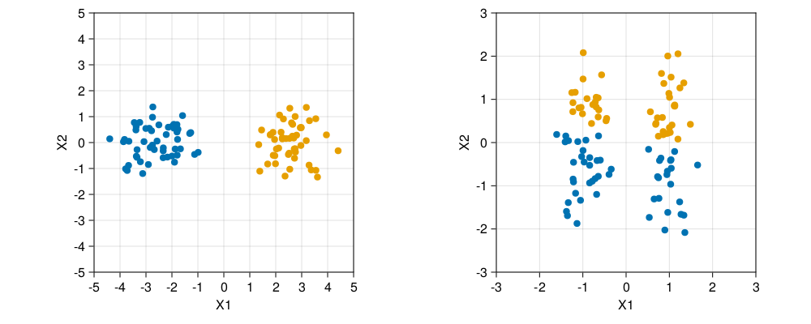


The material in this section is mostly borrowed from:

Trevor Hastie, Robert Tibshirani, and Jerome Friedman. *The Elements of Statistical Learning (second edition)* (2009).\
<https://hastie.su.domains/ElemStatLearn/>\
<https://link.springer.com/book/10.1007%2F978-0-387-84858-7>

Section 14.2


## Introduction

The goal of cluster analysis is to group or segment a collection of objects into subsets or "clusters", such that objects within a cluster are more closely related than objects in different clusters.

Many datasets exhibit a hierarchical structure, with no clear demarcation of clusters, and clusters can themselves be grouped successively such that clusters within one group are more similar than those in different groups. Deciding where to make the "cut" is usually done by setting parameters of a clustering algorithm, and almost always involves an arbitrary choice by the user.

Central to all clustering methods is the notion of the degree of similarity (or dissimilarity) between the objects being clustered. Sometimes data are presented directly in terms of proximity/similarity between objects. More often we have measurements (e.g. gene expression) on objects (e.g. genes or samples) that we want to cluster, and a (dis)similariy matrix must be constructed first.

## Dissimilarities based on measurements

Assume we have measurements $x_{ij}$ for objects $i=1,2,\dots,N$ on variables (or attributes) $j=1,2,\dots,p$. Usually, we first define a dissimilarity function $d_j(x_{ij},x_{i'j})$ between values of the $j$th attribute, and  then define the dissimilarity between objects as

$$
D(x_i,x_{i'})=\sum_{j=1}^p w_j \cdot d_j(x_{ij},x_{i'j})
$$

with $w_j$ a weight assigned to the $j$th attribute that determines its  relative influence in the overall dissimilarity between objects. By convention we scale the weights such that $\sum_j w_j=1$.


To give all attributes equal influence in the object dissimilarity, we must set $w_j\sim 1/\overline{d_j}$, with

$$
\overline{d_j}=\frac{1}{N^2} \sum_{i=1}^N  \sum_{i'=1}^N d_j(x_{ij},x_{i'j})
$$ 


Setting $w_j=1$ for all $j$ does **not** necessarily give all attributes equal influence! To see this, we compute the average object dissimilarity over all pairs of objects as

$$
\begin{aligned}
\bar D &= \frac1{N^2}\sum_{i=1}^N \sum_{i'=1}^N D(x_i,x_{i'}) = \sum_{j=1}^p w_j \cdot \bar{d}_j,
\end{aligned}
$$
with $\bar{d}_j$ defined above. Hence the relative influence of the $j$th attribute is $w_j \cdot \bar{d}_j$.


With squared-error distance, the average object dissimilarity on the $j$th attribute is proportional to its variance.


The most common choice of dissimilarity function is squared-error distance: 

$$
d_j(x_{ij},x_{i'j}) = (x_{ij}-x_{i'j})^2
$$

Define the mean and variance of each attribute over all objects as

$$
\begin{aligned}
\mu_j &= \frac1N \sum_{i=1}^N x_{ij}\\\\
\sigma_j^2 &= \frac1N \sum_{i=1}^N (x_{ij}-\mu_j)^2
\end{aligned}
$$

Then
$$
\begin{aligned}
    \overline{d_j} &= \frac1{N^2}\sum_{i=1}^N \sum_{i'=1}^N (x_{ij}-x_{i'j})^2\\\\
    &= \frac{1}{N^2}\sum_{i=1}^N \sum_{i'=1}^N \left((x_{ij}-\mu_j) - (x_{i'j}-\mu_j)\right)^2\\\\
    &= \frac1N \sum_{i=1}^N (x_{ij}-\mu_j)^2 + \frac1N \sum_{i=1}^N (x_{i'j}-\mu_j)^2 = 2 \sigma_j^2
\end{aligned}
$$

It is often recommended to standardize data before clustering:

$$
x_{ij} \to y_{ij}=\frac{x_{ij}-\mu_j}{\sigma_j}
$$

With squared-error loss, this is equivalent to setting weights $w_j \sim 1/\sigma_j^2 \sim 1/\bar{d}_j$, that is, to give all attributes equal influence on the average object dissimilarity.

Beware that sometimes some attributes exhibit more grouping tendency than others, which may be obscured by standardizing.



Randomly sampled data from a mixture of two multivariate distributions with means differing only in the first dimension, showing the raw (left) and standardized (data) colored according to K-means cluster label. Standardization has obscured the two well-separated groups. Note that each plot uses the same units in the horizontal and vertical axes.

Filter attributes by their variance before standardizing...


## Combinatorial clustering

Combinatorial clustering algorithms assign each object to a cluster without regard to a probability model describing the data. Understanding combinatorial clustering is a necessary basis for understanding probabilistic methods.

In combinatorial clustering, a prespecified number of clusters $K<N$ is postulated ($N$ the   number of objects). An assignment of objects $i\in\{1,\dots,N\}$ to clusters $k\in\{1,\dots,K\}$ is charcterized by a many-to-one mapping or encoder $k=C(i)$.

$C$ is obtained by minizing the "within cluster" point scatter:

$$
W(C) = \frac12 \sum_{k=1}^K \sum_{C(i)=k} \sum_{C(i')=k} d(x_i,x_{i'})
$$

$W(C)$ characterizes the extent to which objects assigned to the  same cluster tend to be close to one another. Notice that: 

$$
\begin{aligned}
    T &= \frac12 \sum_{i=1}^N \sum_{i'=1}^N d_{ii'} \\\\
    &= \frac12 \sum_{k=1}^K \sum_{C(i)=k}  \left(\sum_{C(i')=k} d_{ii'} + \sum_{C(i')\neq k} d_{ii'}\right) \\\\
    &= W(C) + B(C)
\end{aligned}
$$
 where $d_{ii'} = d(x_i,x_{i'})$ and
 
 $$ 
 B(C) = \frac12 \sum_{k=1}^K \sum_{C(i)=k} \sum_{C(i')\neq k} d_{ii'}
$$     
is the "between cluster" point scatter.

$B(C)$ characterizes the extent to which objects assigned to different clusters tend to be far apart.

Since $T$ is constant given the data, minimizing $W(C)$ is equivalent to maximizing $B(C)$.

## $K$-means clustering

The $K$-means algorithm uses the squared Euclidean distance
$$
d(x_i,x_{i'}) = \sum_{j=1}^p (x_{ij}-x_{i'j})^2 = \\| x_i - x_{i'}\\|^2
$$ 
and an iterative greedy descent algorithm to minimize $W(C)$.

Using the Euclidean distance expression, $W(C)$ can be written as 
$$
W(C) = \sum_{k=1}^K N_k \sum_{C(i)=k} \\| x_i - \overline{x_k}\\|^2
$$
where $N_k$ is the number of objects assigned to cluster $k$, and $\overline{x_k}=(\overline{x_{1k}},\dots,\overline{x_{pk}})$ is the mean vector associated to cluster $k$.

$W(C)$ is minimized if within each cluster, the average dissimilarity of the objects from the cluster mean, as defined by the points in that cluster, is minimized.

Note that for any set of objects $S$,
$$
\overline{x_S} = \frac{1}{|S|} \sum_{i\in S} x_i = \argmin_m \sum_{i\in S}\\|x_i-m\\|^2
$$

Hence
$$
\begin{aligned}
\min_C W(C) &= \min_C \sum_{k=1}^K N_k \sum_{C(i)=k} \\| x_i - \overline{x_k}\\|^2  \\\\
& = \min_{C} \min_{\\{m_k\\}}\sum_{k=1}^K N_k \sum_{C(i)=k} \\| x_i - m_k\\|^2
\end{aligned} 
$$

This result is used in a greedy descent algorithm where alternatingly the mean vectors are updated for the current cluster assignments, and object assignments are updated by assigning objects to the nearest current mean vector.


- For a given cluster assignment $C$, the total cluster variance $W(C)$ is minimized with respect to $\{m_1,\dots, m_K\}$ yielding the means of the currently assigned clusters. That is 
    
$$
 m_k = \frac1{N_k} \sum_{C(i)=k} x_i
$$
    
- Given a current set of means $\{m_1,\dots, m_K\}$, $W(C)$ is minimized by assigning each observation to the closest (current) cluster mean. That is, 

$$
C(i) = \argmin_{1\leq k\leq K} \\| x_i - m_k \\|
$$

- These steps are iterated until the assignments do not change.


### How to choose the number of clusters $K$?

Find "kink" in the within-cluster-dissimilarity: Read Elements of Statistical Learning Section 14.3.8, 14.3.11

## Assignment


We will analyze expression data from the TCGA paper:

[*Comprehensive molecular portraits of human breast tumours*](https://doi.org/10.1038/nature11412). Nature 490, 61--70 (2012).

Gene expression data are available from:

<https://gdc.cancer.gov/about-data/publications/brca_2012>

1.  Download the expression data file "BRCA.exp.348.med.txt" and the paper Supplementary Tables spreadsheet.

2.  Filter for the most variable genes, and create data structures for the expression data, estrogen receptor (ER) status, and the AJCC cancer stage of each individual.

3.  Apply K-means clustering to the expression data.Does your K-means implementation standardize data by default or not? Choose an appropriate value of $K$ in K-means and justify  your choice (cf. ESL Sections 14.3.8 and 14.3.11). Compare standardized vs non-standardized data.

4.  Do the individuals cluster by ER status? By cancer stage?

