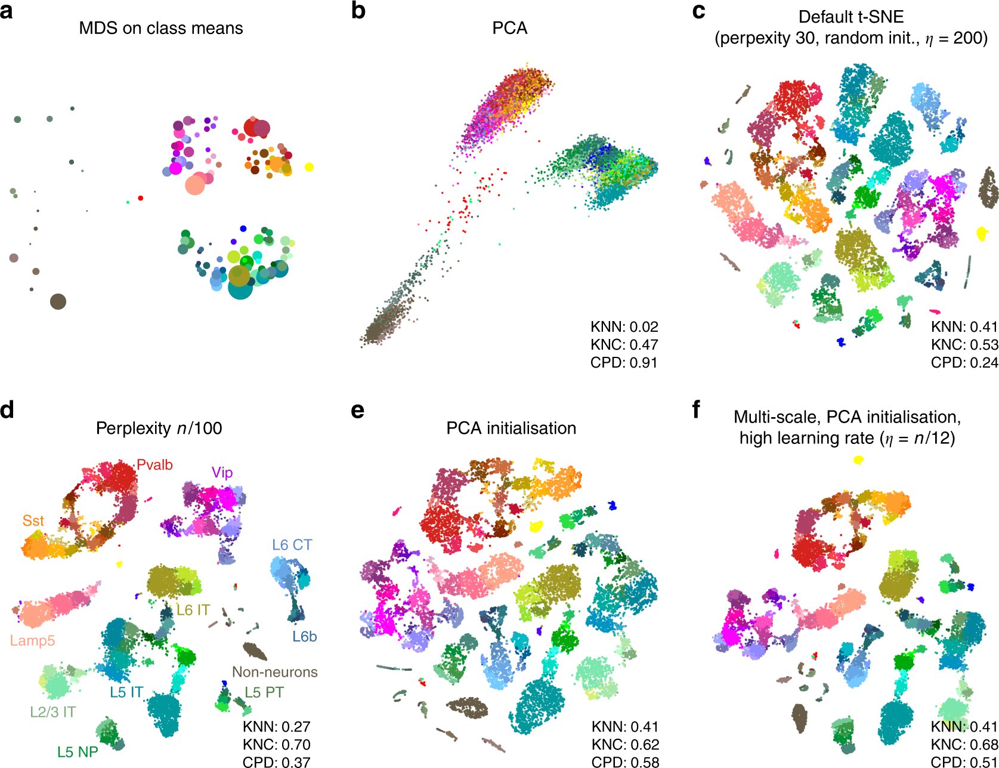
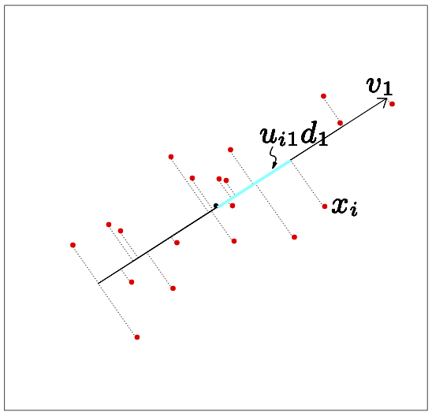
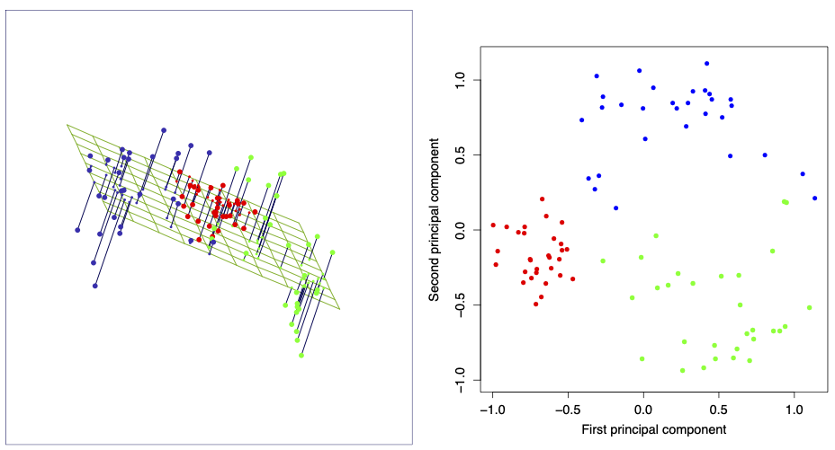


Trevor Hastie, Robert Tibshirani, and Jerome Friedman.The Elements of Statistical Learning (second edition) (2009). 

<https://hastie.su.domains/ElemStatLearn/>\
<https://link.springer.com/book/10.1007%2F978-0-387-84858-7>

Section 14.5.1

Tipping, Michael E., and Christopher M. Bishop. [*"Probabilistic principal component analysis."*](https://doi.org/10.1111/1467-9868.00196) Journal of the Royal Statistical Society: Series B (Statistical Methodology) 61.3 (1999): 611-622.


## Dimensionality reduction

Assume we have a set of $N$ observations (e.g. cells) of $p$ variables (e.g. genes).

Dimensionality reduction consists of representing the observations in a lower-dimensional space with dimension $q\ll p$ while preserving some characteristics (e.g. relative distance) of the original $p$-dimensional representation.

For visualizing relationships among observations, we typically use $q=2$.



Two-dimensional visualization of single-cell data.

Figure obtained from [full text on EuropePMC](https://europepmc.org/article/MED/31780648).


## Principal component analysis (PCA)

Assume we have a set of $N$ observations $x_1,\dots,x_N\in \mathbb{R}^p$ of $p$ variables, collected in the $N\times p$ matrix $\mathbf{X}$.

The principal components of $\mathbf{X}$ provide a sequence of best linear approximations to $\mathbf{X}$, representing $\mathbf{X}$ by a line ($q=1$), plane ($q=2$), etc. in $p$-dimensional space.



The best rank-1 linear approximation of a set of data.

The best rank-2 linear approximation of a set of data.

Figures from the [Elements of Statistical Learning](https://hastie.su.domains/ElemStatLearn/).


A rank-$q$ linear model in $p$-dimensional space takes the form

$$
f(y) = \mu + y_1 v_1 + \dots + y_q v_q = \mu + \mathbf{V}_q z,
$$

where $\mu\in\mathbb{R}^p$ is a location vector, $z\in\mathbb{R}^q$ is a (low-dimensional) vector, and $\mathbf{V}_q=(v_1,\dots,v_q)$ is a $p\times q$ matrix of $q$ orthogonal unit vectors,    

$$
\begin{aligned}
    v_k v_{k'}^T = \sum_{j=1}^p v_{kj}v_{k'j}= \delta_{kk'}
\end{aligned}
$$

Fitting this model to the data using least squares amounts to minimizing the reconstruction error:

$$
\min_{\mu,\\{y_{i}\\},\mathbf{V}\_q} \sum_{i=1}^N \Bigl\\| x_i - \mu - \mathbf{V}_q z_i \Bigr\\|^2
$$

Partial optimization for $\mu$ and the $y_i$ gives 

$$
\begin{aligned}
    \hat{\mu} &= \bar x = \frac1{N}\sum_{i=1}^N x_i\\\\
    \hat{z}_i &= \mathbf{V}_q^T(x_i-\bar{x})
\end{aligned}
$$

Plugging this into () leaves us to find the orthogonal matrix $\mathbf{V}_q$: 

$$
\begin{aligned}
    \min_{\mathbf{V}\_q} \sum_{i=1}^{N} \Bigl\\| (x_i - \bar{x}) - \mathbf{V}_q\mathbf{V}_q^T(x_i-\bar{x}) \Bigr\\|^2
\end{aligned}
$$

It can be shown that the optimal solution is found when $\mathbf{V}_q=(v_1,\dots,v_q)$ contains the $q$ eigenvectors with largest eigenvalues of the $p\times p$ matrix $\mathbf{X}^T\mathbf{X}$ (if the data is centred such that $\bar x=0$).

The solution can be expressed using the [singular value decomposition](https://en.wikipedia.org/wiki/Singular_value_decomposition) of the obsered data matrix $\mathbf{X}$:

$$
\mathbf{X} = \mathbf{U} \Lambda \mathbf{V}^T
$$

where $\mathbf{U}$ is an $N\times p$ orthogonal matrix ($\mathbf{U}^T\mathbf{U}=\mathbf{I}_p$) whose columns are called the *left singular vectors*, $\mathbf{V}$ is a $p\times p$ orthogonal matrix ($\mathbf{V}^T\mathbf{V}=\mathbf{I}_p$) whose columns are called the *right singular vectors*, and $\Lambda$ is a $p\times p$ diagonal matrix with diagonal elements $\lambda_1\geq \lambda_2 \geq \dots \geq \lambda_p\geq 0$ called the *singular values*.

The solution $\mathbf{V}_q$ above consists of the first $q$ columns of $\mathbf{V}$.

The columns of $\mathbf{U}\Lambda$ are called the *principal components* of $\mathbf{X}$. The first $q$ principal components are $\mathbf{U}_q\Lambda_q$. Each principal component is a vector in $\R^N$, that is, it takes a value for each observation. The solution $\hat{z}_i$ above consists of the rows of $\mathbf{U}_q\Lambda_q$, that is, for each observation $i$, $\hat{z}_i$ consists of the values of the first $q$ principal components for observation $i$.

## Probabilistic PCA

Probabilistic PCA is a continuous generalization of the [Gaussian mixture model](../../cluster-analysis/mixture-distributions/) where we again assume that an observation $X=(x_1,\dots,x_p)$ of $p$ variables is generated by a latent variable $Z$:

In the Gaussian mixture model, $Z$ is assumed to take discrete values leading to clustered observations. Here we assume that $Z=(z_1,\dots,z_q)$ is a $q$-dimensional *continous* variable with distribution

$$
Z\sim \mathcal{N}(0,\mathbf{I})
$$

that is, we assume each $z_i$ is drawn from an independent normal distribution with mean zero and standard deviation 1. The conditional distribution of $X$ given $Z$ is just like in the discrete mixture distribution assumed to be a multivariate normal with mean dependent on the value of $Z$; the covariance matrix is assumed to be a multiple of the identity matrix, meaning that conditional on the latent factors $Z$, the $p$ observed features $X$ are *independent* and have equal error distribution:

$$
p(x \mid z) = \mathcal{N}(\mathbf{\mu} + \mathbf{V}z, \sigma^2 \mathbf{I})
$$

where $\mu\in\R^p$ is a mean offset vector, $\mathbf{V}\in\R^{p\times q}$ is a linear maps, and $\sigma^2>0$ a common variance parameter for all $p$ dimensions. Note the similarity between this model and the model above.

Following the Gaussian mixture model example, we want to maximize the likelihood of the observed data, which follows the **marginal distribution**

$$
p(x) = \int dz\\; p(x\mid z) p(z)
$$

which can be interpreted as a "continuous" Gaussian mixture distribution. Unlike in the finite mixture model, this integral can in fact be solved using properties of the [multivariate normal distribution](https://en.wikipedia.org/wiki/Multivariate_normal_distribution):

$$
p(x) = \mathcal{N}(\mu,\mathbf{C})
$$

with covariance matrix $\mathbf{C}=\mathbf{V}\mathbf{V}^T+\sigma^2\mathbf{I}$. The corresponding log-likelihood for $N$ observations $x_1.\dots,x_N\in\R^p$  is

$$
\mathcal{L} = -\frac{N}{2}\Bigl\\{p \ln(2\pi) + \ln(\det(\mathbf{C})) + \mathrm{tr}(\mathbf{C}^{-1}\mathbf{S}) \Bigr\\}
$$

where 

$$
\mathbf{S}= \frac{1}{N}\sum_{i=1}^N (x_i-\mu)(x_i-\mu)
$$

The maximum-likelihood for $\mu$ is the sample mean, $\hat{\mu}=\overline{x}=\frac{1}{N}\sum_{i=1}^N x_i$, such that $\mathbf{S}$ is the sample covariance matrix. The log-likelihood function measures how much $\mathbf{C}$ differs from the sample covariance and is maximized by making $\mathbf{C}$ as "similar" as possible to it. The solution turns out to be the standard PCA solution where the columns of $\mathbf{V}$ are the $q$ eigenvectors with largest eigenvalues of $\mathbf{S}$. This conclusion is valid only if we assume the *independent error model*, where features are independent given latent factors, that is, the latent factors explain *all* the covariance between the features. In summary:


If we assume that our high-dimensional observations are generated by a linear combination of low-dimensional latent (=hidden) factors, and the observed features are independent given the latent factors, then the maximum-likelihood solution for the map between latent and observed space is PCA. 


Note the important benefit of the probabilistic approach. In standard PCA, we simply fit a linear function to a set of observation, without giving any thought to the deviations (errors) between the (noisy) observations and the fitted model. In probabilistic PCA, as in all generative models, we must be explicit about our assumptions, and standard PCA is only recovered if we assume that features are independent given the latent factors. 
