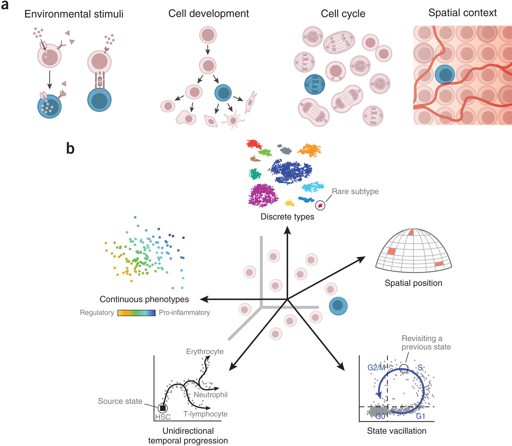
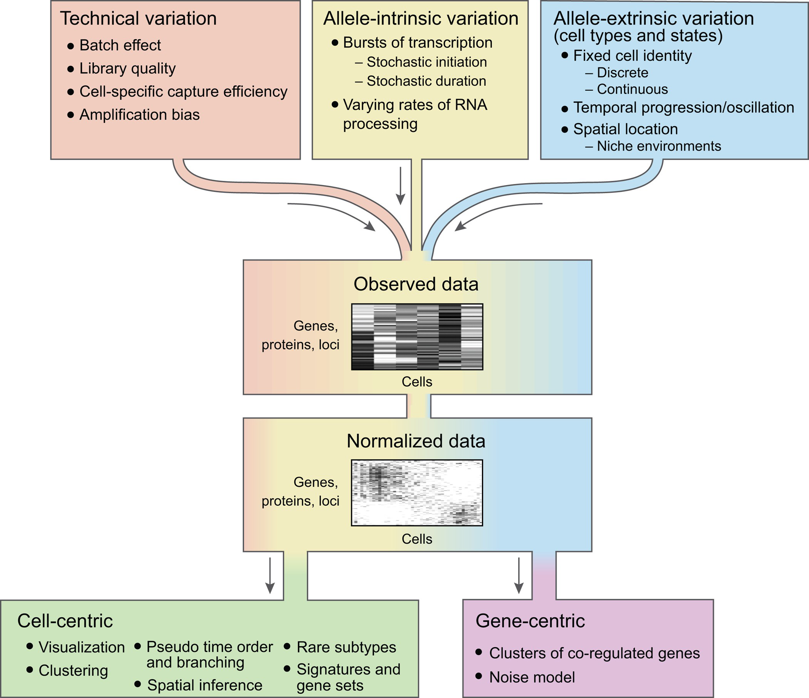
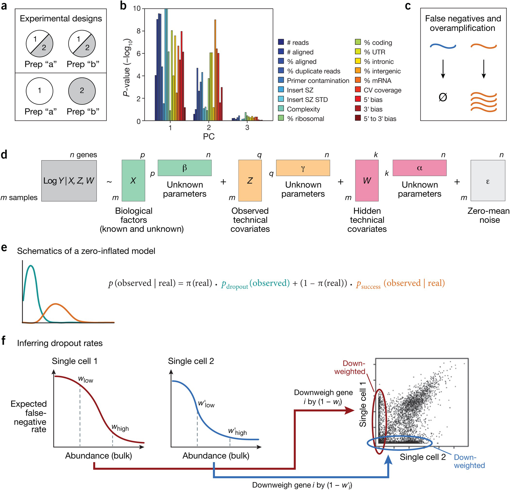


A Wagner, A Regev & N Yosef. [*Revealing the vectors of cellular identity with Single-cell genomics.*](https://www.nature.com/articles/nbt.3711) Nature Biotechnology **34**:1145 (2016).

See also:

Kobak & Berens. [*The art of using t-SNE for single-cell transcriptomics*](https://doi.org/10.1038/s41467-019-13056-x). Nat. Comm. **10**:5416 (2019)

R Jiang, *et al.* [*Statistics or biology: the zero-inflation controversy about scRNA-seq data.*](https://doi.org/10.1186/s13059-022-02601-5) Genome Biology **23**: 31 (2022)



## Understanding cells

To understand a cell, we must determine the factors that shape its identity:

- its position in a taxonomy of cell types,
- the progress of multiple time-dependent processes happening simultaneously,
- the cell's response to signals from its local environment,
- the location and neighbourhood in which it resides.

**Technological advances have enabled genome-wide profiling of RNA, DNA, protein, epigenetic modifications, chromatin accessibility, and other molecular events in single cells.**



Diverse factors combine to create a cell's unique identity.

Figure obtained from [full text on EuropePMC](https://europepmc.org/article/MED/27824854).


## Sources of variation in single-cell genomics



Biological and technical factors combine to determine the measured genomic profiles of single cells.

Figure obtained from [full text on EuropePMC](https://europepmc.org/article/MED/27824854).


**Technical variation:**

- Due to technical factors in the data generation process.
- Main axes of variation in scRNA-seq often dominated by technical factors.
- False negatives (expressed but undetected) and false positives (overamplification) are due to minute quantities of starting RNA material and corresponding need for massive amplification.

**Allele-intrinsic variation:**

- Stochastic factors intrinsic to the molecular mechanisms that control gene expression.
- Does not correlate between two alleles of the same gene.

**Allele-extrinsic variation**

- Factors extrinsic to the process of transcription.
- Contribute to establishing differences between cell types or states, either stably or transiently.
- Correlated between two alleles of the same gene.

**Most studies aim to understand allele-extrinsic variation and its function, while technical and allele-intrinsic variations are major confounders.**



Technical confounders of single-cell RNA-seq and computational methods to handle them.

Figure obtained from [full text on EuropePMC](https://europepmc.org/article/MED/27824854).


## Addressing overamplification

False-positive detections due to amplification occur at early PCR amplification cycle.

Can be addressed using random molecular tags (RMTs), also called unique molecular identifiers (UMIs):

- Short barcode attached to 3' or 5' end of cDNA molecules before amplification.
- After amplification, the number of unique barcodes associated with reads aligned to a gene/transcript, rather than number of aligned reads serves as the gene/transcript abundance.

Beware:

- Sequencing errors will cause RMT sequences that are close to but not identical, and need to be collapsed.
- "Barcode collision" -- two or more copies of a transcript may receive the same barcode, making them appear as a single copy.

## Addressing false negatives

Limited efficiency of RNA capture and conversion to cDNA leads to dropout events: transcripts that are expressed in the cell but undetected in its mRNA profile.

**Zero-inflated models:**

Gene expression is modelled as a mixture of two distributions:

- one in which it is successfully amplified and detected at a level that correlates with its true abundance,
- one in which it is undetected because of technical effects.

(Hidden) component labels can be inferred using EM.

Only cells belonging to the "success" component are used for downstream analysis, e.g. differential expression analysis between    subpopulations of cells.

## Revealing the vectors of cellular identity

Single-cell genomics is a means to identify and understand the factors that jointly define a cell's identity:

-   Discrete cell types and subtypes
-   Continuous phenotypic spectra
-   Dynamic processes
-   Spatial location

### Distinguishing discrete cell types and subtypes

Single-cell analysis can detect cellular subtypes that cannot be defined by a handful of markers, or for which markers are not yet known.

Classification of cells in discrete subtypes is a problem in unsupervised clusterring.

Key challenges:

-   Exponential increasing scale of single-cell data.
-   Ensuring reproducible classification.
-   Finding the proper granularity and detecting hierarchies of cell types and subtypes, especially when cell type frequency varies by multiple orders of magnitude.
-   Distilling molecular markers and signatures to characterize cell types.
-   Matching the resulting classes to known cell types.
-   Visualizing, sharing, and comparing classifications.

### Continuous phenotypic spectra

-   Sometimes more appropriate to speak of a continuous phenotypic spectrum within a type than of a discrete cell type. e.g. a cell's ability to trigger an immune response.
-   Continuous facets can be characterized by combining dimensionality reduction (e.g. PCA) with enrichment for functional annotation.
-   Prior knowledge can be used to interpret the biological relevance of the data's main axes of variation.

### Mapping dynamic processes

-   Cells undergo dynamic transitions, incl. short-term responses to environmental signals, cell differentiation, oscillations, etc.
-   Single-cell genomics provides a snapshot of the entire dynamic
    process: the set of single cells captured at any time point will Stochastically contain cells positioned in different instantaneous time points along the temporal trajectory.
-   Temporal ordering can be recovered by creating a graph that connects cells by their profile similarity and finding an optimal path on this graph.
-   This introduces the notion of "pseudo-time".

### Inference of spatial location

-   Most high-throughput single-cell approaches require dissociation of tissues and therefore lose spatial information.
-   Spatial information can be obtained for a limited number of "landmark" genes.
-   Computational methods can combine limited spatial cues for landmark genes with single-cell RNA-seq from the same type of tissue.
-   Limited number of landmarks expressed at any spatial position and dropouts in single-cell RNA-seq can severely compromise the mapping.
-   Requires tissues with "canonical" structure (e.g. developing embryo, most normal tissues), which is faithfully reproduced in replicate samples.

## Assignment


Kobak & Berens. *The art of using t-SNE for single-cell transcriptomics*. Nat. Comm. **10**:5416 (2019) <https://doi.org/10.1038/s41467-019-13056-x>

See also: <https://github.com/berenslab/rna-seq-tsne>
