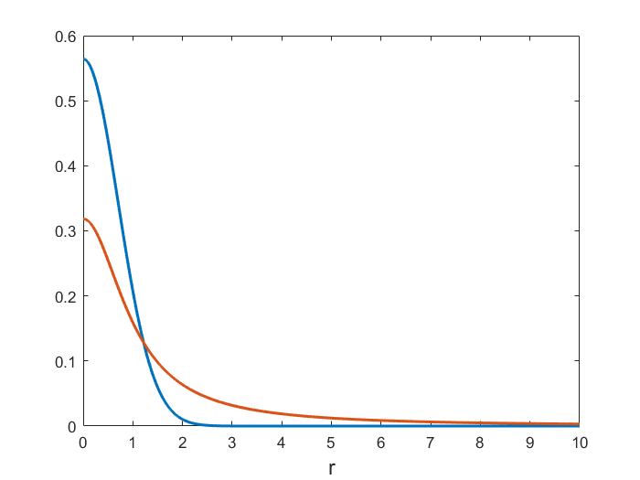
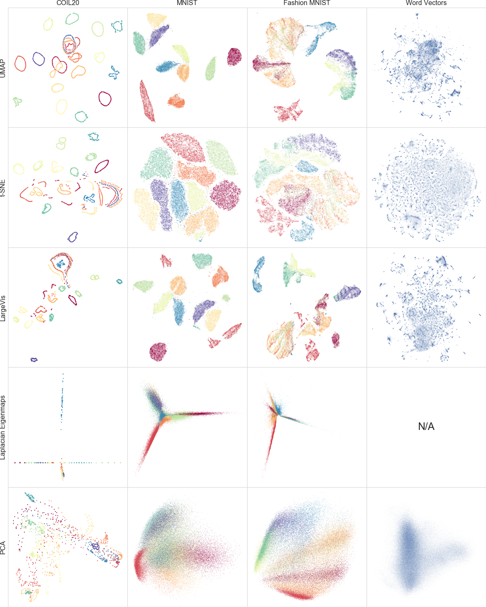


\[TSNE\] L.J.P. van der Maaten and G.E. Hinton. [*Visualizing Data Using t-SNE*](https://www.jmlr.org/papers/volume9/vandermaaten08a/vandermaaten08a.pdf). Journal of Machine Learning Research 9(Nov):2579-2605, 2008.

<https://lvdmaaten.github.io/tsne/>
    
\[UMAP\] McInnes, L, Healy, J, [*UMAP: Uniform Manifold Approximation and Projection for Dimension Reduction*](https://arxiv.org/abs/1802.03426), ArXiv e-prints 1802.03426, 2018

<https://github.com/lmcinnes/umap>


 

## t-Stochastic Neighbor Embedding (t-SNE)

Linear dimensionality reduction methods (like PCA) may not able to retain both the local and global structure of the data in a single map.

t-SNE is a non-linear method that aims to overcome this limitation.

t-SNE is particularly successful at visualizing high-dimensional data (reducing it to two dimensions).

Care must be taken when applying t-SNE due to random initialization of the algorithm, which may lead to solutions that do not represent the global structure of the data well.

### (Symmetric) Stochastic Neighbor Embedding (SNE)

As before, assume we have a set of $N$ observations $x_1,\dots,x_N\in \mathbb{R}^p$ of $p$ variables, collected in the $N\times p$ matrix $\mathbf{X}$.

SNE introduces a directional similarity of $x_j$ to $x_i$,

$$
\begin{aligned}
    p_{j\mid i} = \frac{\exp\bigl(-\frac{1}{2\sigma_i^2}\|x_i-x_j\|^2\bigr)}{\sum_{k\neq i}\exp\bigl(-\frac{1}{2\sigma_i^2}\|x_i-x_k\|^2\bigr)}
\end{aligned}
$$

The variances $\sigma_i$ are chosen such that the perplexities
    
$$
\begin{aligned}
    {\cal P}_i = \exp\Bigl(-\sum_{j\neq i} p_{j\mid i}\log p_{j\mid i}\Bigr)
\end{aligned}
$$ 

take some prespecified value.

Symmetric, undirectional similarities are defined as

$$
\begin{aligned}
    p_{ij} = \frac{p_{j\mid i}+p_{i\mid j}}{2n}
\end{aligned}
$$ 

such that $\sum_{ij}p_{ij}=1$

A map is a two or three-dimensional representation ${\cal Y}=\{y_1,\dots,y_N\}$ of the high-dimensional data ${\cal X}=\{x_1,\dots,X_N\}$.

In the low-dimensional representation, we define the probability of picking $y_i$ and $y_j$ as neighbors by 

$$
\begin{aligned}
    q_{ij} = \frac{\exp\bigl(-\|y_i-y_j\|^2\bigr)}{\sum_{k\neq l}\exp\bigl(-\|y_k-y_l\|^2\bigr)}
\end{aligned}
$$

(Symmetric) Stochastic Neighbor Embedding (SNE) finds the map ${\cal Y}$ that minimizes the mismatch between $p_{ij}$ and $q_{ij}$, across all pairs $i$ and $j$.

The mismatch cost function is given by the Kullback-Leibler divergence: 

$$
\begin{aligned}
    C = \sum_i \sum_j p_{ij} \log \frac{p_{ij}}{q_{ij}}\geq 0
\end{aligned}
$$ 

with $C=0$ if, and only if, $q_{ij}=p_{ij}$ for all $i$ and $j$.

### SNE suffers from a "crowding problem"

The volume of a sphere with radius $r$ in $p$ dimensions scales as $r^p$.

Consider a cluster of datapoints that are approximately uniformly distributed in a sphere of radius $r$.

If $p\gg 2$, then the available 2-dimensional area to model the distances in this cluster accurately will be too small compared to the total area available, forcing clusters of nearby points to crush together.

### Heavy-tails in the low-dimensional space resolve the crowding problem

A heavy-tail distribution in the low-dimensional space allows a moderate distance in the high-dimensional space to be faithfully modelled by a much larger distance in the map.

In t-SNE a Student t-distribution with 1 d.o.f. (a Cauchy distribution) is used as the heavy-tailed distribution in the low-dimensional map: 

$$
\begin{aligned}
    q_{ij} = \frac{\left(1+\|y_i-y_j\|^2\right)^{-1}}{\sum_{k\neq l}\left(1+\|y_k-y_l\|^2\right)^{-1}}
\end{aligned}
$$

The Cauchy distribution offers additional advantages in the numerical optimization of the cost function.



Gaussian ($\sigma=1/\sqrt{2}$) vs Cauchy p.d.f. for $r\geq 0$.



### Summary

t-SNE:

- puts emphasis on modelling dissimilar datapoints by means of large pairwise distances, and similar datapoints by small pairwise distances,
- offers dramatic improvement in finding and preserving local structure in the data, compared to, for instance, PCA.

Optimization of the t-SNE cost function is easier than optimizing
earlier SNE versions, but:

- the cost function is non-convex,
- several optimization parameters need to be chosen,
- the constructed solutions depend on these choices and may be different each time t-SNE is run from an initial random configuration.

Formal theory supporting t-SNE is lacking:

- similarity measures and cost function are based on heuristics, appealing to "intuitive" justifications,
- there is no formal generative model connecting high- and low-dimensional representations,
- the probability semantics used to describe t-SNE is descriptive, rather than foundational.

## Uniform Manifold Approximation and Projection (UMAP)

In the words of the authors:

- UMAPs design decisions were all grounded in a solid theoretic foundation and not derived through experimentation with any particular task focused objective function.
- The theoretical foundations for UMAP are largely based in manifold theory and topological data analysis.
- A purely computational view \[of UMAP\] fails to shed any light upon the reasoning that underlies the algorithmic decisions made in UMAP.

### A computational view of UMAP

From a practical computational perspective, UMAP can be described in
terms of, construction of, and operations on, weighted graphs:

-   Graph construction:
    1.  Construct a weighted k-neighbour graph
    2.  Apply some transform on the edges to represent local distance.
    3.  Deal with the inherent asymmetry of the k-neighbour graph.\

-   Graph layout:
    1.  Define a cost function that preserves desired characteristics of   this k-neighbour graph.
    2.  Find a low dimensional representation which optimizes this cost function.

t-SNE and UMAP can both be cast in this form, but with some (subtle)
differences in the edge weighting (dissimilarity measure) and graph
layout (cost function).

## A comparison of dimension reduction algorithms



A comparison of dimension reduction algorithms.

Figure from the [UMAP paper](https://arxiv.org/abs/1802.03426).



## Practical recommendations

- Claims of UMAP or t-SNE (or related methods) being superior are usually overrated.

- Both algorithms suffer from a need for careful parameter tuning and initialization choices.

- Using and understanding one algorithm well is more important flipping between algorithms and never changing default parameters.

An excellent reference for using t-SNE for single-cell data:

Kobak & Berens. [*The art of using t-SNE for single-cell transcriptomics*.](https://doi.org/10.1038/s41467-019-13056-x) Nat. Comm. **10**:5416 (2019)

See also: <https://github.com/berenslab/rna-seq-tsne>

## Assignment



In this assignment you will go through a typical single-cell RNA-seq analysis, trying to reproduce some published results from:

Kobak & Berens. [*The art of using t-SNE for single-cell transcriptomics*.](https://doi.org/10.1038/s41467-019-13056-x) Nat. Comm. **10**:5416 (2019)

**Prerequisites**

- The Github repository accompanying the paper: https://github.com/berenslab/rna-seq-tsne.
- Mouse V1 (primary visual cortex) and ALM (anterior lateral motor cortex) SMART-seq data: https://portal.brain-map.org/atlases-and-data/rnaseq/mouse-v1-and-alm-smart-seq. This is the data that Kobak & Berens refer to as the "Tasic et al. data":
  
    - Download the gene-level read count zip files.
    - Read the readme files (of course!)
    - We will work with the exon matrix files only.

- Cell cluster annotation file: https://raw.githubusercontent.com/berenslab/rna-seq-tsne/master/data/tasic-sample_heatmap_plot_data.csv.

**Tasks**

- Write a script to read the SMART-seq data files and merge the data in a single data structure. Your structure will need:
  
    - A gene x cell (or cell x gene) read count matrix containing all cells (V1 + ALM). You should have data for 45,768 genes in 25,481 cells.
    - The unique identifiers of all cells.

- Read the cell cluster annotation file and remove all cells that don't have an annotation from your data. You should now have 23,822 cells remaining.
- Remove all cells and all genes that have all near-zero counts. What threshold (number of reads) did Kobak & Berens use to define "near-zero" expression?
- Implement the "Feature selection" steps described in the paper Methods:
  - Compute the fraction of near-zero counts for each gene (using the same threshold as in the previous step) (eq 8 in the paper).
  - Compute the mean log2 expression over the non-zero values for each gene (eq. 9 in the paper).
  - Reproduce Supplementary Figure 4 (without the gene names).
  - Select the relevant genes using eq. 10. You can use the parameter values from Supplementary Figure 4 and don't have to implement the parameter fitting procedure. How many genes do you retain?

- Implement the "Sequencing depth normalization" described in the paper Methods:
  - Note that sequencing depth normalization is applied by computing the library sizes (total number of reads) for each cell using all genes.
  - Keep the normalized data only for the genes from the "feature selection" step.
 
- Perform PCA and t-SNE dimensionality reduction:
  - You may work with the full data if you have sufficient compute resources, otherwise create a small toy dataset where you keep every 25th cell (953 cells in total).
  - Standardize (mean zero, standard deviation one) the data. Recall the lecture on unsupervised clustering: if we want all features (genes) to have equal influence on the clustering/dimensionality reduction, should we standardize over the gene or cell dimension?
  - Do PCA and retain the first two principal components.
  - Apply t-SNE using your choice of software implementation. Generate multiple solutions (easy if you use the toy dataset), similar to Kobak & Berens, Figure 2 (c-f) (you don't need to use identical settings, but explore some of the input settings for t-SNE).

- Generate scatter plot figures:
  
  - Make figures for PCA and the various t-SNE results you generated.
  - Use the colors from the cell cluster annotation file to confirm that your figures look similar to Kobak & Berens, Figure 2. The figures will of course not be identical, especially if you use a toy dataset, but should display similar patterns.
