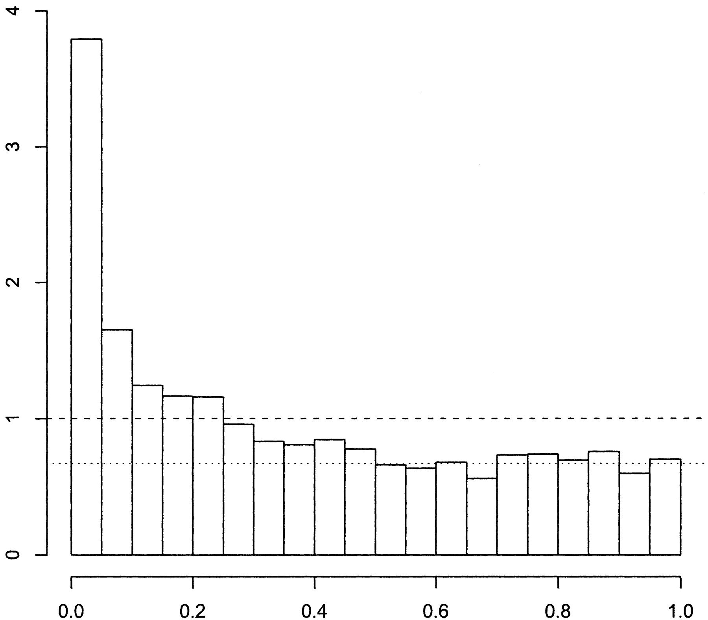
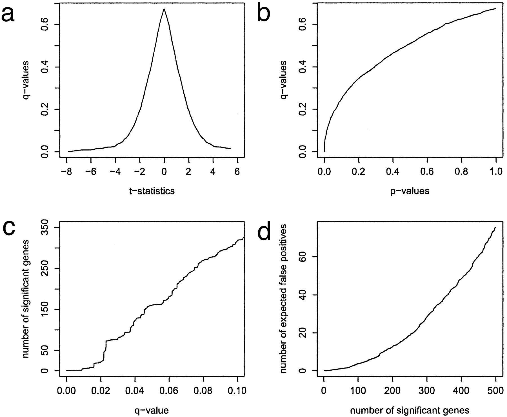


Storey, John D., and Robert Tibshirani. ["Statistical significance for genomewide studies."](https://www.pnas.org/doi/10.1073/pnas.1530509100) Proceedings of the National Academy of Sciences 100.16 (2003): 9440-9445.


We cover the following parts:

- Abstract
- Example 1, differentially expressed genes
- Table 1
- What is a p-value?
- What is the FDR?
- Derivation that p-values are uniformly distributed under the null hypothesis
- Figure 1
- FDR estimation
- Figure 2
- What is a q-value?

 

A density histogram of $p$-values. Figure obtained from [full text on EuropePMC](https://europepmc.org/article/MED/12883005).




Figure obtained from [full text on EuropePMC](https://europepmc.org/article/MED/12883005).

