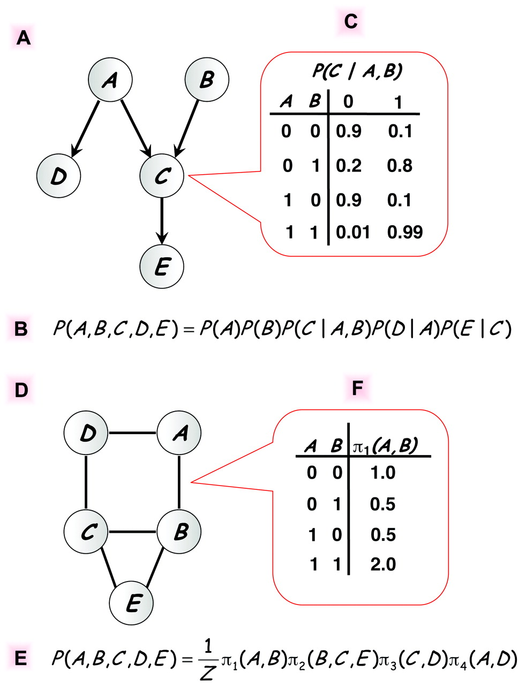
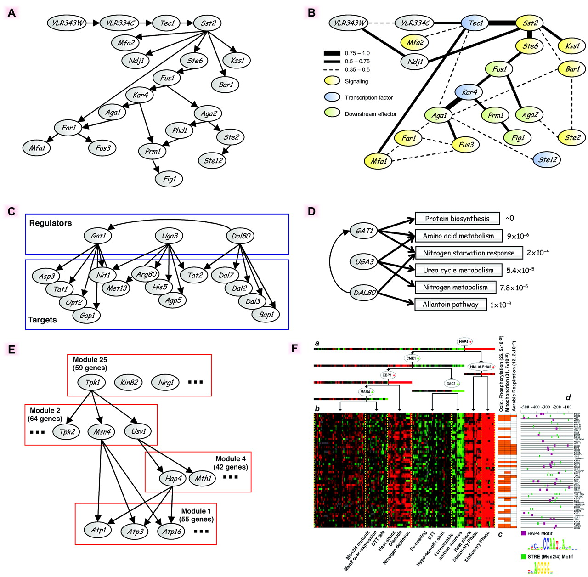


Friedman, [*Inferring Cellular Networks Using Probabilistic Graphical Models*](https://www.science.org/doi/10.1126/science.1094068)

Christopher Bishop. [*Pattern Recognition and Machine Learning*](https://www.microsoft.com/en-us/research/publication/pattern-recognition-machine-learning/) (2006). Chapter 8


## Inferring Cellular Networks Using Probabilistic Graphical Models

### Figure 1



Figure obtained from [full text on EuropePMC](https://europepmc.org/article/med/14764868).

 

### Figure 3



Figure obtained from [full text on EuropePMC](https://europepmc.org/article/med/14764868).


## A crash course in Bayesian networks

In Bayesian networks, the joint distribution over a set $\{X_1,\dots, X_p\}$ of random variables is represented by:

- a directed acyclic graph (DAG) $\cal G$ with the variables as vertices,
- a set of conditional probability distributions,
  $$\begin{aligned}
    P\bigl(X_i \mid \{X_j \mid j\in \mathrm{Pa}_i\}\bigr),
  \end{aligned}$$ 
  where $\mathrm{Pa}_i$ is the set of parents of vertex $i$ in $\mathcal{G}$,

such that 
$$\begin{aligned}
  P(X_1,\dots,X_p) = \prod_{i=1}^p P\bigl(X_i \mid \{X_j \mid j\in \mathrm{Pa}_i\}\bigr)
\end{aligned}$$

In GRN reconstruction:

- $X_i$ represents the expression level of gene $i$,
- $P(X_1,\dots,X_p)$ represents the joint distribution from which (independent) experimental samples are drawn,
- $\mathcal{G}$ represents the unknown GRN.

Assume we have a set of $N$ observations $x_1,\dots,x_N\in \mathbb{R}^p$ of $p$ variables, collected in the $N\times p$ matrix $\mathbf{X}$.

Assume we know $\mathcal{G}$ and the conditional distributions. Then the likelihood of observing the data is: 

$$\begin{aligned}
  P(\mathbf{X}\mid \mathcal{G}) &= \prod_{k=1}^N P(X_{k1},\dots,X_{kp}\mid \mathcal{G})\\\\
  &= \prod_{i=1}^p \prod_{k=1}^N  P\bigl(X_{ki} \mid \{X_{kj} \mid j\in \mathrm{Pa}_i\}\bigr) 
\end{aligned}$$

We can now use an iterative algorithm to optimize $\mathcal{G}$ and the conditional distributions:

- Start with a random graph $\mathcal{G}$.
- Given $\mathcal{G}$, the likelihood decomposes in a product of independent likelihoods, one for each gene, and the conditional distributions can be optimized by standard regression analysis.
- In the next iterations, randomly add, delete, or reverse edges in $\mathcal{G}$, as long as the likelihood improves.

A more formal approach to optimizing $\mathcal{G}$ uses Bayes' theorem: 
$$\begin{aligned}
  P(\mathcal{G}\mid \mathbf{X}) = \frac{P(\mathbf{X}\mid \mathcal{G}) P(\mathcal{G})}{P(\mathbf{X})}
\end{aligned}$$

- $P(\mathcal{G})$ represents the prior distribution: even without seeing any data, not all graphs need to be equally likely *a priori*.
- $P(\mathbf{X})$ represents the marginal distribution: $P(\mathbf{X}) = \sum_{\mathcal{G}'} P(\mathbf{X}\mid \mathcal{G}') P(\mathcal{G}')$. It is independent of $\mathcal{G}$ and can be ignored.

We can use $P(\mathcal{G})$ to encode evidence for causal interactions from integrating genomics and transcriptomics data. This is the main idea from  [Zhu et al. (2004)](https://doi.org/10.1159/000078209).

## Assignment



