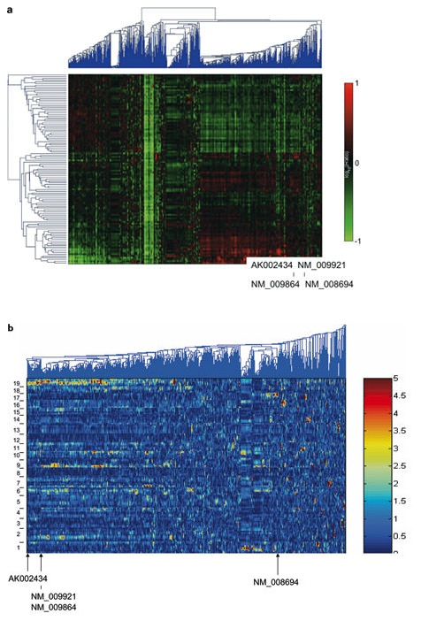
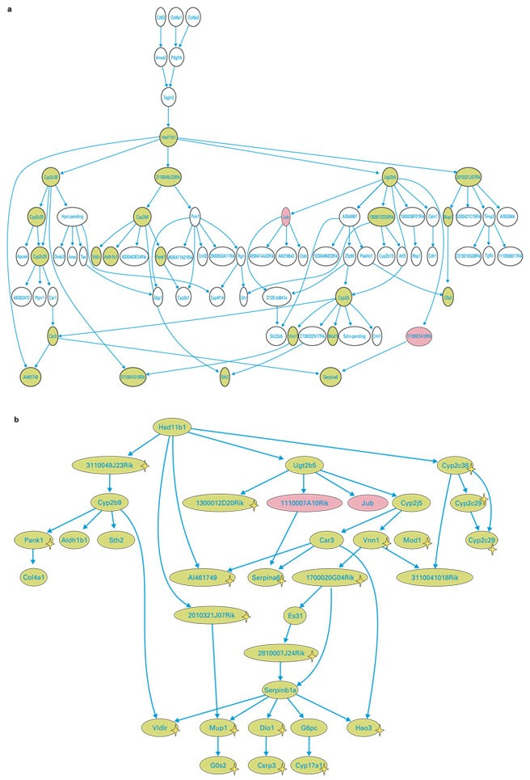
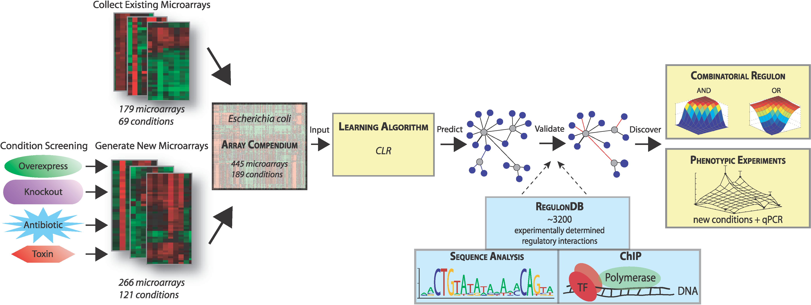
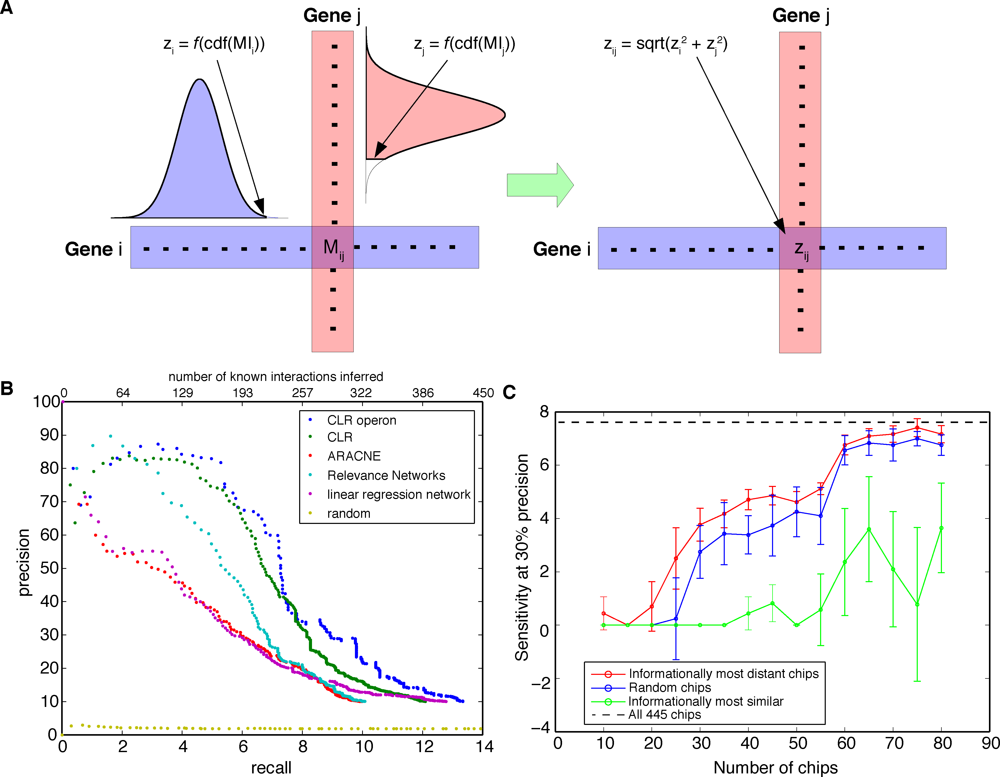
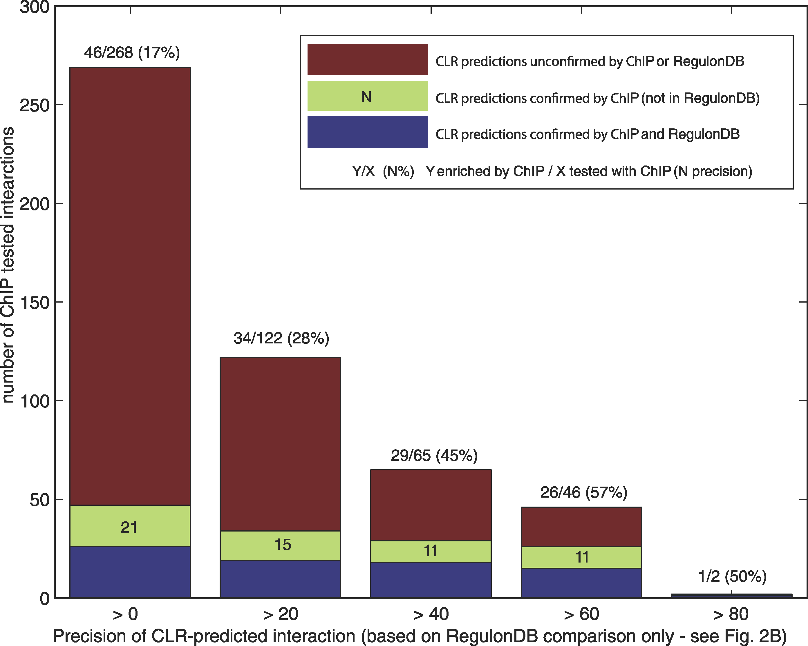
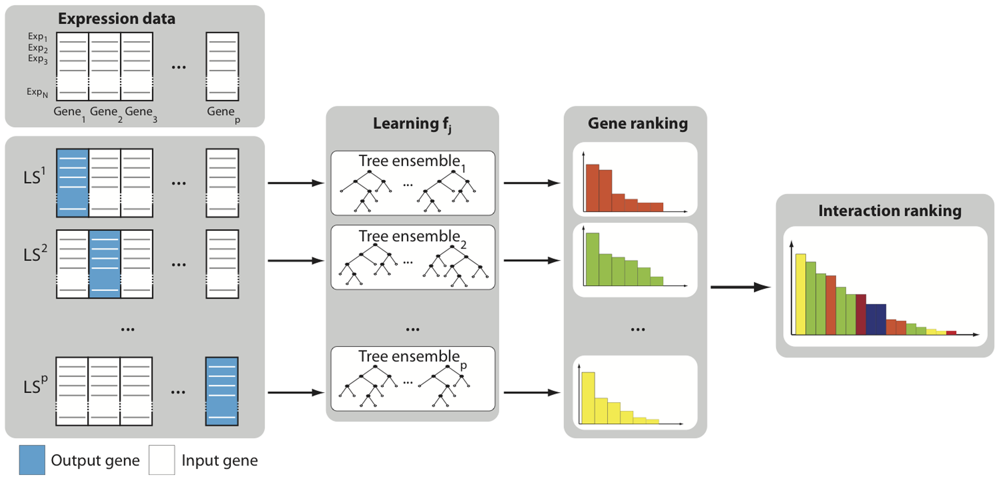
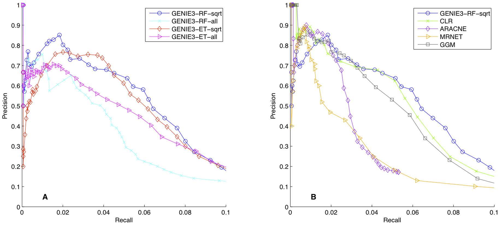



J Zhu et al. [*An integrative genomics approach to the reconstruction of gene networks in segregating populations.*](https://doi.org/10.1159/000078209) Cytogenet Genome Res 105:363–374 (2004)

J Faith *et al.* [*Large-Scale Mapping and Validation of E. coli Transcriptional Regulation from a Compendium of Expression Profiles.*](https://doi.org/10.1371/journal.pbio.0050008) PLOS Biol 5:e8 (2007).

V Huynh-Thu et al. [*Inferring Regulatory Networks from Expression Data Using Tree-Based Methods.*](https://doi.org/10.1371/journal.pone.0012776) PLOS One 5:e12776 (2010).

See also a recent perspective on network inference in Nature: [*Smart software untangles gene regulation in cells*](https://www.nature.com/articles/d41586-022-02826-1)


## An integrative genomics approach to the reconstruction of gene networks in segregating populations

### Figure 1



Figure obtained from [full text on EuropePMC](https://europepmc.org/article/med/15237224).


### Figure 3



Figure obtained from [full text on EuropePMC](https://europepmc.org/article/med/15237224).


## Large-Scale Mapping and Validation of E. coli Transcriptional Regulation from a Compendium of Expression Profiles

### Software

- [Original (Matlab)](http://m3d.mssm.edu/network\_inference.html)
- [R/Bioconductor](https://www.bioconductor.org/packages/release/bioc/html/minet.html)

### Figure 1



Figure obtained from [full text on EuropePMC](https://europepmc.org/article/med/17214507).


### Figure 2



Figure obtained from [full text on EuropePMC](https://europepmc.org/article/med/17214507).


### Figure 5



Figure obtained from [full text on EuropePMC](https://europepmc.org/article/med/17214507).


## Inferring Regulatory Networks from Expression Data Using Tree-Based Methods

### Software

[Genie3 (Python, Matlab, R)](https://github.com/vahuynh/GENIE3)

### Figure 1



Figure obtained from [full text on EuropePMC](https://europepmc.org/article/med/20927193).


### Figure 4



Figure obtained from [full text on EuropePMC](https://europepmc.org/article/med/20927193).

