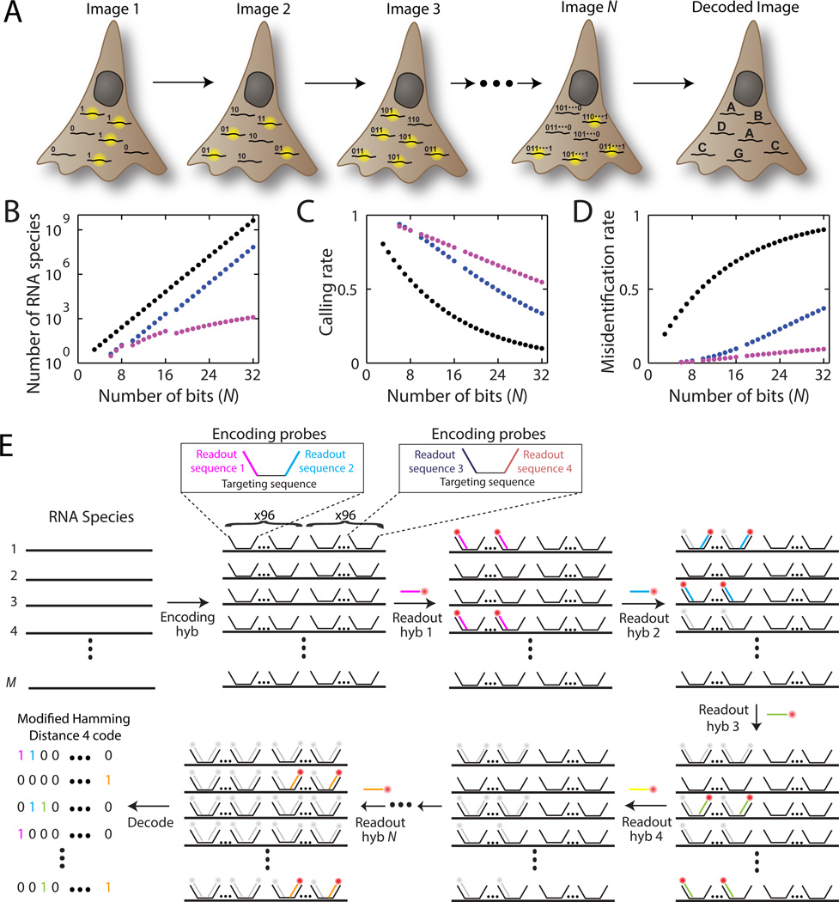


Chen, Kok Hao, et al. [*Spatially resolved, highly multiplexed RNA profiling in single cells.*](https://www.science.org/doi/full/10.1126/science.aaa6090) Science 348.6233 (2015): aaa6090. ?



Arnol, et al. [*Modeling Cell-Cell Interactions from Spatial Molecular Data with Spatial Variance Component Analysis.*](https://doi.org/10.1016/j.celrep.2019.08.077) Cell Reports 29:202 (2019)

See also [this review](https://genomebiology.biomedcentral.com/articles/10.1186/s13059-022-02653-7)


## Spatially resolved, highly multiplexed RNA profiling in single cells

### Figure 1

MERFISH = multiplexed error-robust FISH ([fluorescence in situ hybridization](https://www.genome.gov/genetics-glossary/Fluorescence-In-Situ-Hybridization)), a single-molecule imaging approach that allows the copy numbers and spatial localizations of thousands of RNA species to be determined in single cells.

Each RNA labelled with set of **encoding probes**, which contain:

- *targeting sequences* that bind the RNA
- *readout sequences* that bind fluorescently labeled readout probes

Each RNA assigned a binary word in a modified, error-robust Hamming code:

- Sequences have $N$ bits, $N$ number of fluorescent labels
- Sequences have exactly four 1's. Same number of ones guarantees same overall error rate in situation where $1\to 0$ and $0\to 1$ error rates are different.
- Sequences have a mutual [Hamming distance](https://en.wikipedia.org/wiki/Hamming_distance) of at least 4.

[Hamming codes](https://en.wikipedia.org/wiki/Hamming(7,4)) can do 1-bit error correction, see [example on wikipedia](https://en.wikipedia.org/wiki/Hamming(7,4)#Channel_coding). Higher calling rate and lower misidentification rate at the cost of encoding fewer RNA species with a given number of bits.



Figure obtained from [full text on EuropePMC](https://europepmc.org/article/med/25858977).


### Figure 2



Figure obtained from [full text on EuropePMC](https://europepmc.org/article/med/25858977).
